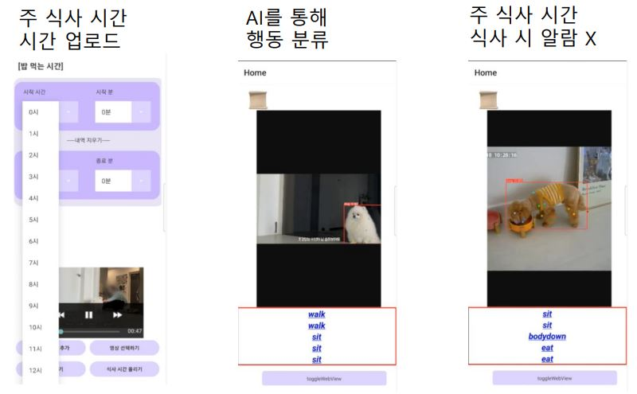

# SKTFLYAI_Pet_Anomaly
반려동물 행동 분석을 통한 이상 징후 탐지
<H2> 프로젝트 목적 </H2>

반려견의 일상적인 행동 패턴 모니터링
평소와 다른 패터이 감지되면 알림을 통해 파악 

* 이 프로젝트에서 정의한 이상 징후 탐지 : 같은 시간에 반복적인 행동을 하지 않았을 때를 이상 징후라 한다.
  
ex) 아침 9:00 ~ 10:00 사이에 항상 아침을 먹는 강아지가 먹지 않았을 때!

<H2> 사용 기술 </H2>
* React native  
* Flask  
* Pytorch  
* Azure  

<H2> Docker Hub </H2>

docker push dlskawo0409/pet:tagname

<H2> 결과 이미지 </H2>

